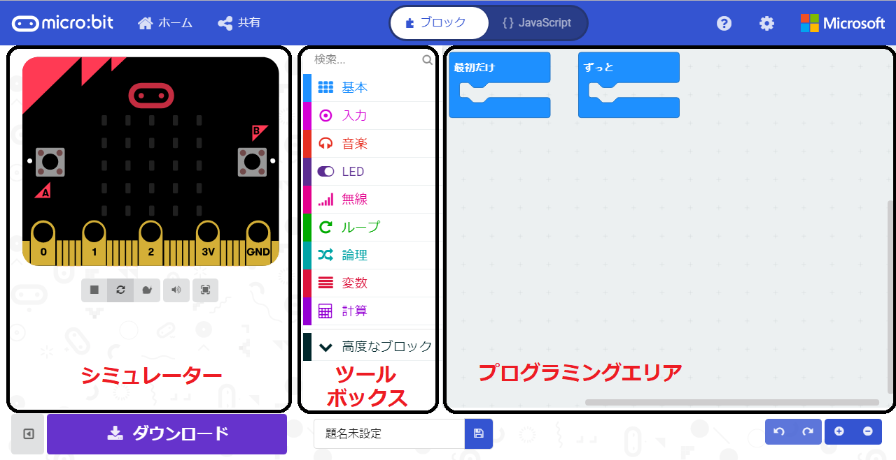
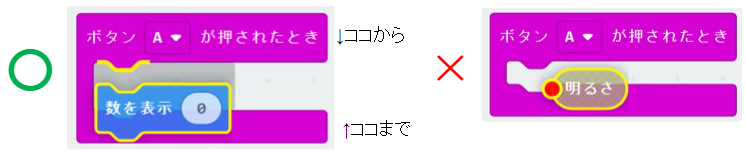
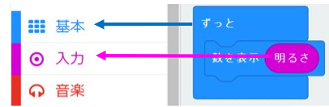
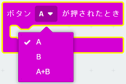
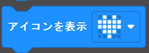
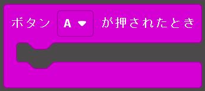
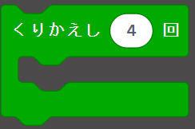
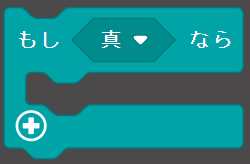
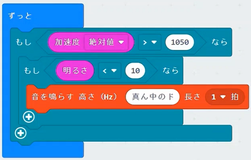

<!-- headingDivider: 1
paginate: true
footer: ""
_class: title
-->

# 2021/2/21講座ご出席の方へ

時間内で説明できなかった分を追記しました。

追記箇所（このページ内）・・・改善例：ゆっくり動かしても反応させる  
説明動画（Youtube）へのリンク・・・https://youtu.be/ZFoelLtBVEI

# かんたんプログラミング講座

--micro:bitでさわれるプログラミング--  

# 今回の教材

## micro:bit

- **センサー付き小型コンピュータ**
  - 教育用で安い(約2千円）

## Makecode
- **micro:bit用開発ソフト**
  - ウェブサイトを開くだけ（アプリもある）
  - スマホ・ゲ ーム機でもOK

# Makecodeの使い方

## 動画で説明[→リンク](https://youtube.com/playlist?list=PLU60AG3nzUjTtgSNYaa19dJ528FSEWQkj)

1. ネット検索で専用ウェブサイト「Makecode」を開く
2. 「micro:bit」→「新しいプロジェクト」をクリック
3. ブロックを組み合わせる
4. できたら「ダウンロード」
5. 「MICROBIT」を選択し「保存」

# 画面の説明

> 画像元：参考サイト1「micro:bit日本公式販売元取説（Switch Education）」より  

# ブロックの使い方
|  |  |
| :--- | :--- |
| 形を合わせる ||
| 色=ツール種類 | |
| ▼は選択できる | |
# 練習

- アイコンを追加  

- 数字・文字を追加（文字は日本語は表示できません）  
 

- Aボタンがおされたとき光らせる  
←間にブロックを入れる

# プログラミングの基本動作は3つだけ！

| 動作|ブロック|説明・実習内容 |
|:---|:---|:---|
|1.順次|省略|書いた順番に動く，プログラムの基本動作 （例：ハート点灯→消灯）|
|2.繰り返し||実習：Bボタンを押すとライトが5回点滅（+入力・ループブロック）
|3.条件分岐（もし～なら）||実習：Aボタンを押したとき，もし明るければライトが5回点滅（+論理ブロック）|

# 実習：役立ちそうなものをつくってみる

**お題：「夜，家に誰かが入ってきたら知らせてくれる」**

進め方
- 動作させたい内容を細かく分ける
- 言葉で表してみる
  - ドアにmicrobitを付けておいて
  - もしゆさぶられた時，暗かったら
  - 音を鳴らす
- ブロックを組み合わせてプログラミング
- 使ってみて問題があれば修正

## もっといい方法もないか考えてみよう!

# 改善例：ゆっくり動かしても反応させる

「ゆっくり」を **「加速度※ が止まっている状態より大きい」**  と表現

※加速度とは？  
物にかかる力のこと。止まっていても重力の力がかかるのでゼロではない。動きの激しさを数字で表せる。

# micro:bitについている主な部品とできること

|部品|ツールボックス|主にできること|
|:---|:---|:---|
|明るさセンサー|入力|明るさを数字で表す|
|温度センサー|入力|温度を数字で表す|
|加速度センサー|入力|動きの激しさを数字で表す|
|コンパス|入力|北がゼロの角度を表す|
|マイク|入力|音量を数値で表す|
|スピーカー|音楽|音の高さをドレミ・数値で指定して鳴らす|
|bluetooth|無線|他のmicro:bitと通信する|

# 他の機能紹介

- 本格的な言語(Javascript,Python)へ切り替え。
- アプリ(スマホ)は無線書込み可能
- モーターをつけてロボットを作成

## 詳しくは販売元の取説参照（参考サイト1・QRコード）

# 補足：プログラミング的思考＝問題解決力

学校教育の目的はプログラミングを通じた問題解決力の向上！  
**プログラムを書く能力ではない！**([参考サイト2,3,4](#参考サイト)，画像：[ベネッセ教育情報サイト](https://benesse.jp/programming/beneprog/2018/07/13/computationalthinking/))
  

# まとめ
- プログラミングの基本：順次・繰返し・条件分岐
- プログラミングするときは動作を細かく分け，言葉にする
- micro:bit,Makecodeだけでもけっこう高度なことができる
- 詳しい使い方は参考サイト1を読む
- [今日の資料・動画↓](https://github.com/K-TechResearch/Programing_LV1/blob/main/%E8%AC%9B%E5%BA%A7%E3%82%B9%E3%83%A9%E3%82%A4%E3%83%88%E3%82%99.md)  

# 参考サイト
1. micro:bit日本公式販売元取説（Switch Education）  
https://learn.switch-education.com/microbit-tutorial/

1. 学習指導要領  
https://www.mext.go.jp/content/1413522_001.pdf  
https://www.mext.go.jp/content/1384661_6_1_3.pdf  

1. 文部科学省_小学校段階におけるプログラミング教育の在り方について（議論の取りまとめ）
https://www.mext.go.jp/b_menu/shingi/chousa/shotou/122/attach/1372525.htm

1. ベネッセ教育情報サイト_図で解説「プログラミング的思考」とは  
https://benesse.jp/programming/beneprog/2018/07/13/computationalthinking/