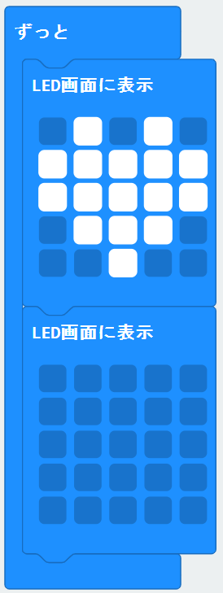
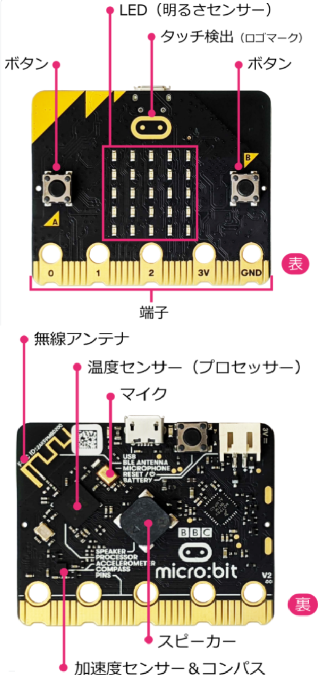
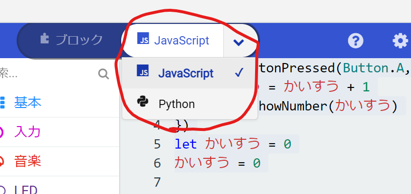
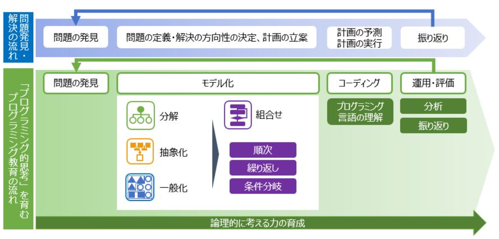

<!-- headingDivider: 1
paginate: true -->

# かんたんプログラミング講座

--micro:bitでさわれるプログラミング--  

# 今回のゴール

- プログラミングの基本がわかる
- 何を使えば良いかわかる

## デモのついでに事前アンケート

無線で集計。当てはまる人はAボタンを押す

1. プログラミングの授業はありましたか？
2. キーボードでひらがな・ABCは書けますか？
3. マウスのクリック，ドラッグはできますか？

# micro:bit？

- **センサー付き小型コンピュータ**
  - 教育用かつ安い(約2千円）

## Makecode？
- **micro:bit用開発ソフト**
  - ウェブサイトを開けば使える（アプリもある）
  - スマホ・ゲ ーム機でもOK
  - Microsoftが開発

## 詳しくは公式の取説参照（参考サイト１）

# 使い方

1. ネット検索で専用ウェブサイト「Makecode」を開く
2. 「micro:bit」→「新しいプロジェクト」をクリック
3. プログラミングする
4. できたら「ダウンロード」
5. 「MICROBIT」を選択し「保存」

## 詳しくは動画で！[→リンク](https://youtube.com/playlist?list=PLU60AG3nzUjTtgSNYaa19dJ528FSEWQkj)

# プログラミングの基本は３つ（AIでも同じ）

## 1.順次
書いた順番に動く，プログラムの基本動作（例：ハート点灯→消灯）
## 2.繰返し
実習：ゆらすとハートが5回点滅（+入力・ループブロック）
- 10000回でも数字を変えるだけ！
## 3.条件分岐（もし～なら）
実習：Aボタンを押したとき，もしロゴが上ならハートが5回点滅（+論理ブロック）

# と言いつつ，もう一つ追加

ふつうは3つですが，中学の数学で習うので今回は紹介

## 4.変数

実習：Aボタンを押すと，押した回数を表示する  
（+計算・変数ブロック）

- 変数：数字や文字を変更して出し入れできる入れ物

## プログラム動作中に数・文字を変えられる！

# 実習：役立ちそうなものをつくってみる

**お題：「夜，家に誰かが入ってきたら知らせるプログラム」**

進め方
- 動作させたい内容を細かく分ける
- 言葉で表してみる
  - ドアにmicrobitを付けておいて
  - もしゆさぶられた時，暗かったら
  - 音を鳴らす
- ブロックを組み合わせてプログラミング
- 実際に使ってみて問題があれば修正

## もっといい方法もないか考えてみよう!

# 実習：改善例

問題点：ゆっくり入ってきたら反応しない
- **「方角（°）」(コンパス）を使って**ドアの角度で反応させる
- 少しでもゆれたら反応させる（**「加速度」を使う**）

問題点：ドアに付けているとき反応してしまう
- **Bボタンを押して10秒後から**反応するようにする

まずはやってみる→観察する(いい方法はないか？)→改善する，を繰り返す  
（実際最近のIT系開発（アジャイル等）は実行重視（実は日本の製造業の真似））

## 「やってみる」が大事！！

# micro:bitの拡張機能

- 本格的な言語(Javascript,Python)へ切り替え。
- アプリ(スマホ)は無線書込み可能
- 配線してロボットも！

(詳しくは参考サイト1，Makecodeのチュートリアルがおススメ)

# 補足：プログラミング的思考＝問題解決力

学校教育の目的はプログラミングを通じた問題解決力の向上！  
**プログラムを書く能力ではない！**([参考サイト2,3,4](#参考サイト)，画像：[ベネッセ教育情報サイト](https://benesse.jp/programming/beneprog/2018/07/13/computationalthinking/))
  

# まとめ
- プログラム基本：順次・繰返し・条件分岐 （＋変数）
- 動作を細かく分け，言葉にしたら，まずはやってみる
- 学校のプログラミング授業の目的は問題解決力の向上
  - 最近の流行りは「まずはやってみる」
- [今日の資料・動画↓](https://github.com/K-TechResearch/Programing_LV1/blob/main/%E8%AC%9B%E5%BA%A7%E3%82%B9%E3%83%A9%E3%82%A4%E3%83%88%E3%82%99.md)

# 参考サイト
1. micro:bit日本公式販売元取説（Switch Education）  
https://learn.switch-education.com/microbit-tutorial/

1. 学習指導要領  
https://www.mext.go.jp/content/1413522_001.pdf  
https://www.mext.go.jp/content/1384661_6_1_3.pdf  

1. 文部科学省_小学校段階におけるプログラミング教育の在り方について（議論の取りまとめ）
https://www.mext.go.jp/b_menu/shingi/chousa/shotou/122/attach/1372525.htm

1. ベネッセ教育情報サイト_図で解説「プログラミング的思考」とは  
https://benesse.jp/programming/beneprog/2018/07/13/computationalthinking/